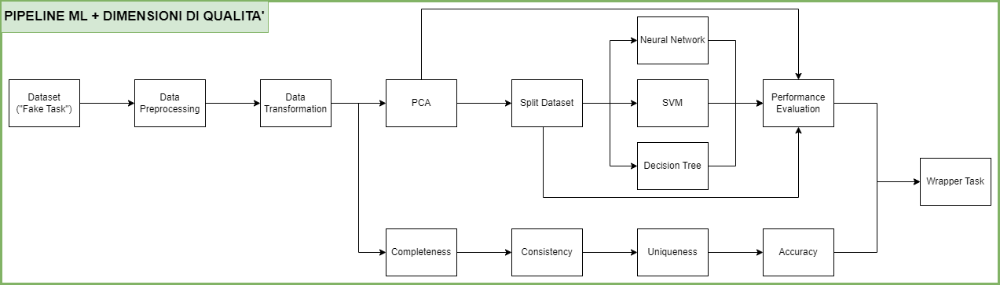

# Progetto Architetture Dati
Data Architecture Project for UNIMIB about Machine Learning, Data Quality and Explainability

## Links Utili

- [Relazione](https://docs.google.com/document/d/1IV3Gf9V8NhbtCMpwyom5nab6pTW0wrw2B98vvv_Iris/edit?usp=sharing)
- [Presentazione](https://unimibit-my.sharepoint.com/personal/e_gargiulo4_campus_unimib_it/_layouts/15/guestaccess.aspx?share=EbSK9e_OlwtKjOP11F5rqQgBEpbfzfVZu8obZHoFk96ZXg&e=91mqyd)

## Pipeline Prima Parte

  

## Autori

- Matteo Cavaleri
- Elio Gargiulo
- Cristian Piacente

## Introduzione al Progetto

In seguito un'introduzione al progetto e al dataset. Si consiglia di consultare la relazione e il progetto in sé per approfondimenti e completezza.

### Il Progetto

TODO

#### Istruzioni per l'esecuzione

Innanzitutto è necessario creare un Python virtual environment ed installare tutte le dipendenze.

##### Creazione e attivazione del virtual environment

Utilizzando la **directory principale** della repository come working directory, eseguire innanzitutto il seguente comando per **creare il virtual environment**:

    python -m venv venv

Una volta creato il virtual environment, esso verrà memorizzato nel filesystem, dunque non sarà necessario ricrearlo ogni volta.

A questo punto è possibile **attivarlo** con

    venv\Scripts\activate

##### Installazione delle dipendenze

Dopo la **prima attivazione**, è necessario **installare tutte le librerie** utilizzate tramite

    pip install -r requirements.txt

##### Esecuzione della Prima Pipeline

Con il virtual environment attivato nella root della repository, per eseguire l'intera pipeline Luigi che effettua operazioni preliminari sul dataset, la creazione dello spazio della PCA, la creazione di tre modelli con la relativa performance evaluation e il check di alcune dimensioni di qualità, eseguire i seguenti comandi:

 1.     cd ml_pipeline
 2.     python -m luigi --module pipeline FullPipeline --local-scheduler

TODO approfondire (in relazione soprattutto).

##### Disattivazione del virtual environment

Quando si desidera uscire dal virtual environment, è sufficiente eseguire il comando

    deactivate

### Il Dataset e le Features

Il dataset è stato selezionato con lo scopo di garantire coerenza e rilevanza nelle
successive analisi condotte, utilizzando dati sensati e non fittizi.

In particolare, la scelta è stata orientata verso un insieme di dati che si prestasse ad
un’analisi con Principal Component Analysis (PCA), la quale richiede una struttura
dati adatta, preferibilmente con variabili numeriche continue e non nulle.

Il dataset riguarda la classificazione binaria di tipi di
vini date le seguenti features (categorie), le quali descrivono la composizione chimica
di un vino:
- __Fixed acidity (acido tartarico)__: Misura della quantità di acido tartarico presente
nel vino, espressa in grammi per decimetro cubo (g/dm³).
- __Volatile acidity (acido acetico)__: Misura della quantità di acido acetico presente
nel vino, espressa in grammi per decimetro cubo (g/dm³).
- __Citric acid (acido citrico)__: Quantità di acido citrico presente nel vino, espressa
in grammi per decimetro cubo (g/dm³).
- __Residual sugar (zucchero residuo)__: Quantità di zucchero residuo nel vino,
espressa in grammi per decimetro cubo (g/dm³).
- __Chlorides (cloruri)__: Concentrazione di cloruri nel vino, espressa in grammi di
cloruro di sodio per decimetro cubo (g/dm³).
- __Free sulfur dioxide (anidride solforosa libera)__: Quantità di anidride solforosa
libera nel vino, espressa in milligrammi per decimetro cubo (mg/dm³).
- __Total sulfur dioxide (anidride solforosa totale)__: Quantità totale di anidride
solforosa presente nel vino, espressa in milligrammi per decimetro cubo
(mg/dm³).
- __Density (densità)__: Densità del vino, espressa in grammi per decimetro cubo
(g/dm³).
- __pH__: Misura dell'acidità o basicità del vino su una scala da 0 a 14.
- __Sulphates (solfati)__: Concentrazione di solfati nel vino, espressa in grammi di
solfato di potassio per decimetro cubo (g/dm³).
- __Alcohol (alcol)__: Percentuale di alcol nel vino per volume (% vol).
- __Quality__: Qualità di un vino espressa con una valutazione da 0 a 10.

La qualità di un vino si esprime con un valore di valutazione da 0 a 10 dunque
potrebbe essere considerata categorica, mentre le altre features, che sono proprietà
chimiche, sono esprimibili attraverso valori continui.

